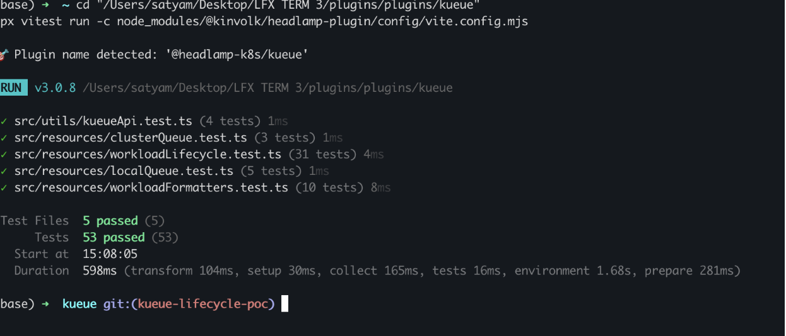
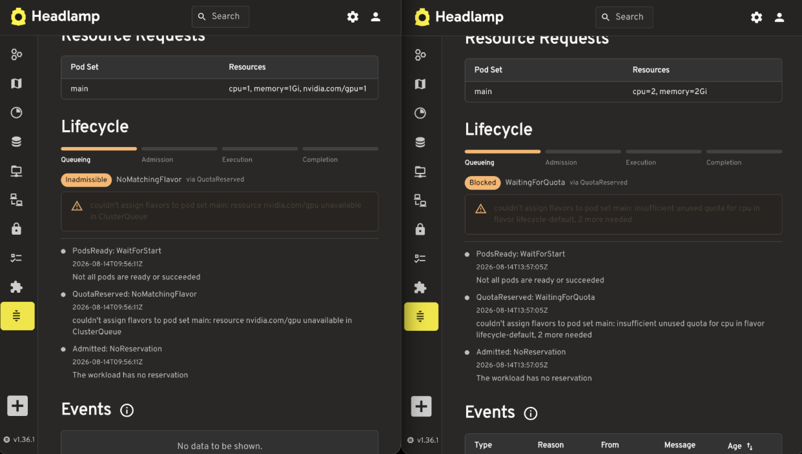
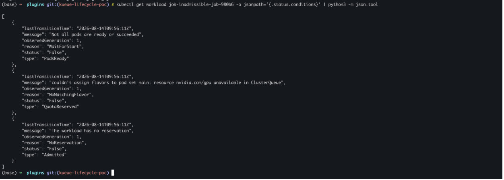
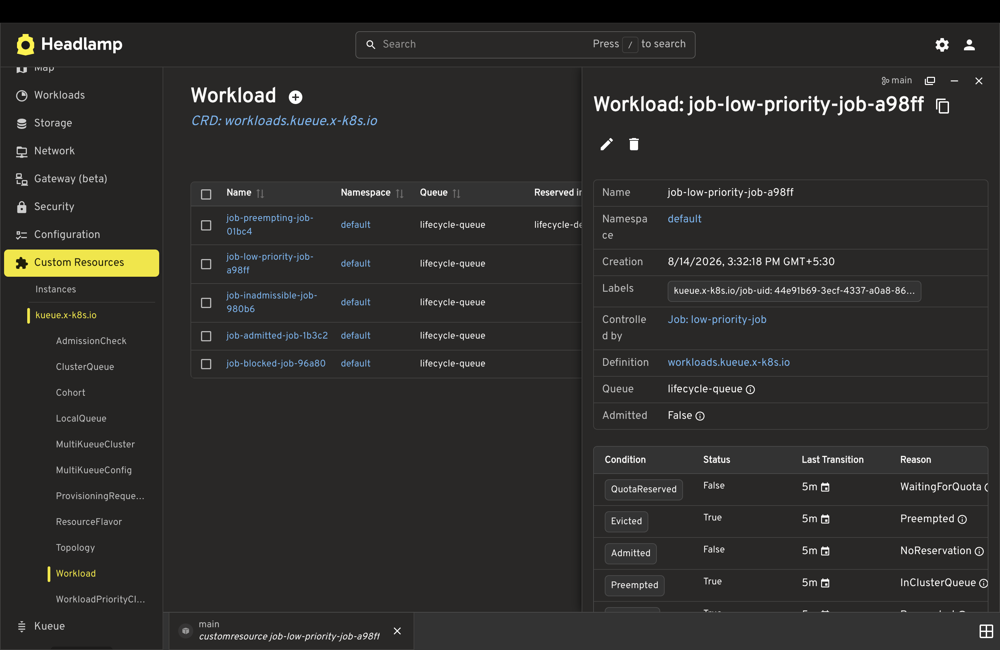

# Kueue Headlamp Plugin

This plugin adds an initial Headlamp UI for [Kueue](https://kueue.sigs.k8s.io/docs/overview/), a Kubernetes-native system for batch workload queueing.

See the [Kueue getting started guide](https://kueue.sigs.k8s.io/docs/getting-started/) to install Kueue and create the queueing resources required by a cluster.

## Current Scope

This plugin currently reads Kueue `ClusterQueue`, `LocalQueue`, `ResourceFlavor`, and `Workload` resources from the Kubernetes API and displays them in basic list and detail pages. It registers a Kueue sidebar section with entries for these resources.

Additional queueing views will be added in later PRs.

## Prerequisites

Kueue CRDs must be installed in the cluster before the plugin can list resources. See the [Kueue installation guide](https://kueue.sigs.k8s.io/docs/getting-started/installation/) for installation instructions.

You can check for the `ClusterQueue`, `LocalQueue`, `ResourceFlavor`, and `Workload` CRDs and resources with:

```bash
kubectl get crd clusterqueues.kueue.x-k8s.io
kubectl get crd localqueues.kueue.x-k8s.io
kubectl get crd resourceflavors.kueue.x-k8s.io
kubectl get crd workloads.kueue.x-k8s.io
kubectl get clusterqueues
kubectl get localqueues -A
kubectl get localqueue <name> -n <namespace> -o yaml
kubectl get resourceflavors
kubectl get workloads -A
kubectl get workload <name> -n <namespace> -o yaml
```

## Test Files

Sample `ClusterQueue`, `LocalQueue`, `ResourceFlavor`, and Job manifests are available in `test-files/deploy/`. The sample Job uses the `team-a-queue` LocalQueue so Kueue can create a real `Workload` for local UI testing.

Apply them to a cluster with Kueue installed:

```bash
kubectl apply -f test-files/deploy/resourceflavor-default.yaml
kubectl apply -f test-files/deploy/resourceflavor-spot.yaml
kubectl apply -f test-files/deploy/resourceflavor-topology.yaml
kubectl apply -f test-files/deploy/clusterqueue-team-a.yaml
kubectl apply -f test-files/deploy/localqueue-team-a.yaml
kubectl apply -f test-files/deploy/job-sample-workload.yaml
kubectl get workloads -A
```

After applying the examples, open `Kueue` > `ClusterQueues`, `Kueue` > `LocalQueues`, `Kueue` > `ResourceFlavors`, or `Kueue` > `Workloads` in Headlamp.

## Development

```bash
npm install
npm run format
npm run build
npm run tsc
npm run lint
npm run test
```

## Workload Lifecycle — Proof of Concept

This section records how the Workload lifecycle-derivation work on the
[`kueue-lifecycle-poc`](https://github.com/krsatyamthakur-droid/plugins/tree/kueue-lifecycle-poc/kueue)
branch was built, tested and operated end to end on a live cluster.

### What it adds

12 files, roughly 1,550 lines:

| File | Lines | Purpose |
| --- | --- | --- |
| `src/resources/workloadLifecycle.ts` | 385 | `deriveLifecycleState` and `buildTimeline` |
| `src/components/workloads/LifecycleSection.tsx` | 186 | Lifecycle details-view section |
| `src/components/workloads/EvictionSummary.tsx` | 84 | Eviction details-view section |
| `src/components/workloads/WorkloadDetailsSection.tsx` | 35 | Section registration wrapper |
| `src/resources/workloadLifecycle.test.ts` | 344 | Unit tests for the above |
| `src/components/workloads/*.stories.tsx` | 253 | Storybook stories for both sections |
| `src/helpers/storybook.tsx` | 37 | Shared story helpers |
| `test-files/deploy/lifecycle-*.yaml` | 211 | Three scenario manifests |

### Architecture constraint

A Workload can be reached by two different routes, and the lifecycle views have to render on
both:

- **The plugin's own pages** — `ClusterQueue`, `LocalQueue`, `ResourceFlavor` and `Workload`
  each have a plugin-owned List and Detail page built on `ResourceListView` and `DetailsGrid`,
  registered via `registerRoute` + `registerSidebarEntry` under the **Kueue** sidebar section.
  Workload's class lives in `src/resources/workload.ts` and its pages in
  `src/components/workloads/{List,Detail}.tsx`, added upstream in
  [`b31ab3c`](https://github.com/krsatyamthakur-droid/plugins/commit/b31ab3c) (PR #924), the
  direct parent of this branch.
- **Headlamp's generic Custom Resource page** — reached through
  *Custom Resources → kueue.x-k8s.io → Workload*, which knows nothing about the plugin.
  `registerDetailsViewSection` injects `LifecycleSection` and `EvictionSummary` here so the same
  views appear on that path too.

The constraint that follows: the lifecycle views cannot assume the plugin's own Detail page is
the only entry point. They are written as details-view sections keyed off the Workload object
rather than as page-level components, so they render identically on both routes.

### Testing

31 test cases across 4 suites, all passing — covering lifecycle-state derivation
(`deriveLifecycleState`), timeline construction from Workload status conditions
(`buildTimeline`), event collapsing (`collapseRepeats`), and the eviction helpers:

```bash
npx vitest run -c node_modules/@kinvolk/headlamp-plugin/config/vite.config.mjs
```

Run against the whole plugin, the same command reports 53 tests across 5 files — the 31 above
are the ones this branch adds.



### Live verification

The plugin was run against a real Kueue installation rather than fixtures. The environment is a
dedicated kind cluster created with `extraMounts`, binding the plugin directory into the node so
a rebuild is picked up by a browser refresh. Kueue v0.19.0 is installed and healthy. Headlamp
runs in-cluster, installed via Helm, authenticated with a ServiceAccount token and reached over
port-forward — the deployment path administrators actually use, rather than the simpler
Docker-on-host route.

```bash
kubectl apply -f test-files/deploy/lifecycle-clusterqueue.yaml
kubectl apply -f test-files/deploy/lifecycle-jobs.yaml
kubectl apply -f test-files/deploy/lifecycle-preemption.yaml
```

These produce admitted, quota-blocked, inadmissible and preempted Workloads simultaneously,
which is what makes the derivation testable: the same cluster, at one timestamp, holds every
state the section distinguishes.

#### Blocked vs. Inadmissible



The two states the feature exists to separate, side by side. Both Workloads report
`QuotaReserved: False` and both read as "not admitted" in a conditions table. The left one
clears by itself when quota frees up; the right one never will, because no flavor in the
ClusterQueue covers `nvidia.com/gpu`. The plugin labels them **Blocked** and **Inadmissible**
respectively, and shows which status field each was derived from.

#### Rendered panel vs. raw API object



The same Workload as the left-hand panel above, fetched raw from the API at the same moment:

```bash
kubectl get workload job-inadmissible-job-980b6 \
  -o jsonpath='{.status.conditions}' | python3 -m json.tool
```

The API response contains no stage, no phase and no ordering — only a flat list of conditions.
Every word in the panel is derived, and the `via QuotaReserved` label makes each derivation
traceable back to the field it came from.

#### Eviction timeline



### Constraints and defects found

**Feature gate.** Kueue only reports the granular `WaitingForQuota` and `NoMatchingFlavor`
reasons when the `UnadmittedWorkloadsObservability` feature gate is enabled. Without it,
`QuotaReserved` carries a generic reason and the Blocked/Inadmissible distinction degrades to
**Pending**. Any upstream version of this work needs to detect that and say so in the UI rather
than silently showing less.

**Defect in the test manifests.** `inadmissible-job` requested `nvidia.com/gpu` without a
matching limit, so the API server rejected the Job and Kueue never saw it — the scenario
demonstrating `NoMatchingFlavor` was the one scenario that could not be applied. Fixed in
[`7bd7408`](https://github.com/krsatyamthakur-droid/plugins/commit/7bd7408).
